<div align="center">


# Portal de Cadastro de Fornecedores e Clientes

Formulário web em etapas que padroniza o cadastro de fornecedores e clientes da Hiperroll Embalagens:
busca os dados da empresa pelo CNPJ, gera a ficha em PDF e avisa os setores responsáveis por e-mail.


<br>

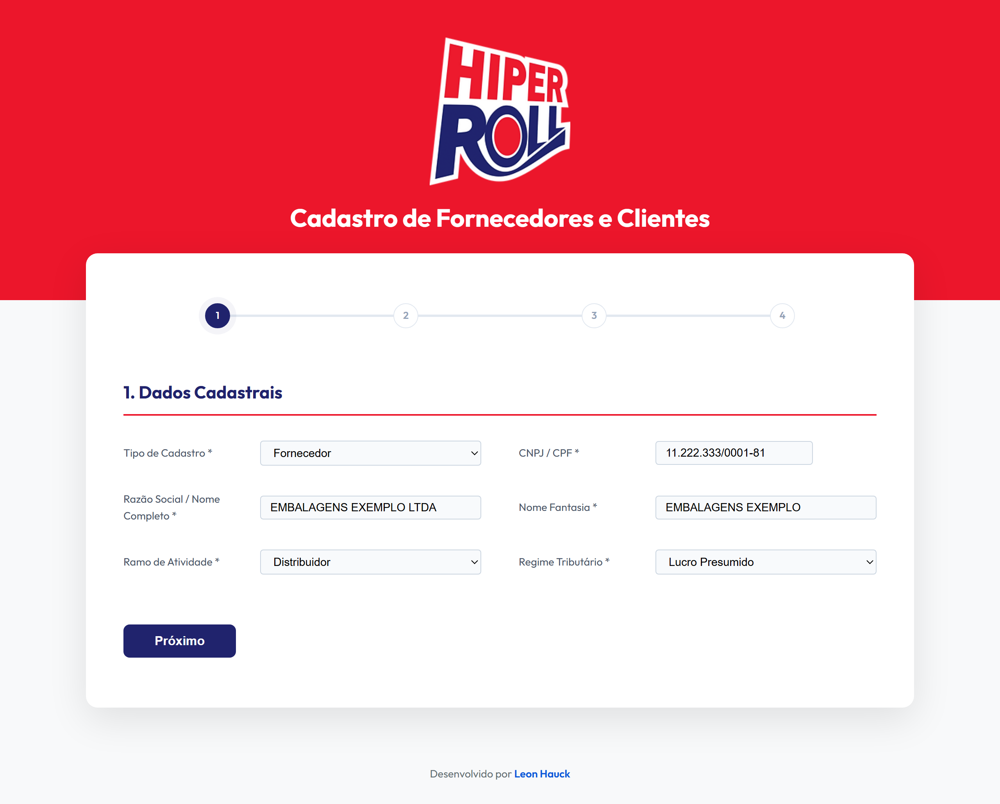

</div>

## Índice

- [Visão geral](#visão-geral)
- [Funcionalidades](#funcionalidades)
- [Telas](#telas)
- [Como funciona](#como-funciona)
- [Tecnologias](#tecnologias)
- [Estrutura do projeto](#estrutura-do-projeto)
- [Configuração](#configuração)
- [Executando localmente](#executando-localmente)
- [Publicação](#publicação)
- [Segurança](#segurança)
- [Documentação de apoio](#documentação-de-apoio)
- [Autor](#autor)

## Visão geral

O portal substitui a ficha de cadastro preenchida à mão por um fluxo digital de quatro etapas. Quem preenche informa o CNPJ e recebe razão social, endereço e contatos já preenchidos; ao final, o sistema gera uma ficha em PDF com a identidade visual da empresa e envia os dados por e-mail para os setores que precisam deles (comercial, fiscal, financeiro e logística).

Não há banco de dados nem etapa de build: são arquivos estáticos e um único script PHP que faz a ponte com o serviço de e-mail.

## Funcionalidades

**Preenchimento assistido**

- Busca automática dos dados da empresa pelo CNPJ, com três fontes em cascata: BrasilAPI v1, BrasilAPI v2 e MinhaReceita.
- Preenchimento do endereço pelo CEP, via ViaCEP.
- Máscaras de CNPJ/CPF, CEP e telefone. O campo de CNPJ aceita letras e números, compatível com o CNPJ alfanumérico.
- Atalhos "Sou Isento" (inscrição estadual) e "Mesmo do principal" (e-mails e telefones do financeiro e da logística).
- Campos condicionais, como "Qual Isenção?", que só aparece quando há isenção fiscal.

**Validação**

- Cada etapa só avança com os campos obrigatórios preenchidos e com e-mail e telefone em formato válido. Os campos com problema ficam destacados em vermelho.
- CNPJ não localizado não trava o cadastro: na segunda tentativa, o portal pede confirmação e libera o preenchimento manual.
- A tecla Enter não envia o formulário por acidente.

**Saída do cadastro**

- Ficha de cadastro em PDF gerada no navegador, com o logotipo da empresa, disponível para download na tela de confirmação.
- E-mail em HTML para um ou mais destinatários, com todos os dados e um botão para baixar a ficha.
- Assunto do e-mail com a razão social, para facilitar a busca na caixa de entrada.
- Log de envio no servidor (`error_email.log`) para diagnóstico.

**Dados coletados**

| Etapa | Conteúdo |
| --- | --- |
| 1. Dados cadastrais | Tipo de cadastro, CNPJ/CPF, razão social, nome fantasia, ramo de atividade, regime tributário |
| 2. Localização e contato | CEP, endereço, cidade, UF, telefone, e-mail, representante |
| 3. Financeiro e fiscal | Inscrição estadual, isenções, forma e prazo de pagamento, contatos do financeiro, enquadramento no IBS/CBS |
| 4. Logística | Horários de recebimento, agendamento, tipo de carga, descarga, restrições de veículo, contatos da logística, observações |

## Telas

> As capturas abaixo usam dados fictícios.

### Formulário em quatro etapas

<table>
  <tr>
    <td width="50%"></td>
    <td width="50%">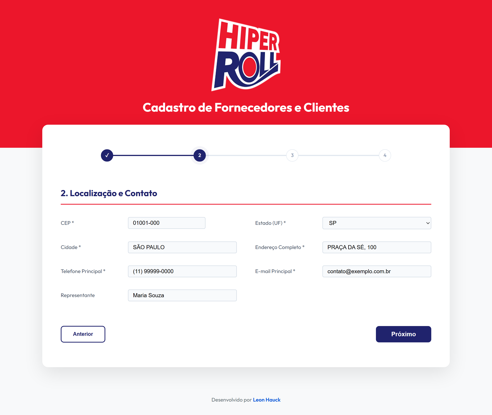</td>
  </tr>
  <tr>
    <td align="center"><b>1. Dados cadastrais</b><br>Razão social e nome fantasia preenchidos a partir do CNPJ</td>
    <td align="center"><b>2. Localização e contato</b><br>Endereço, telefone e e-mail vindos da consulta</td>
  </tr>
  <tr>
    <td>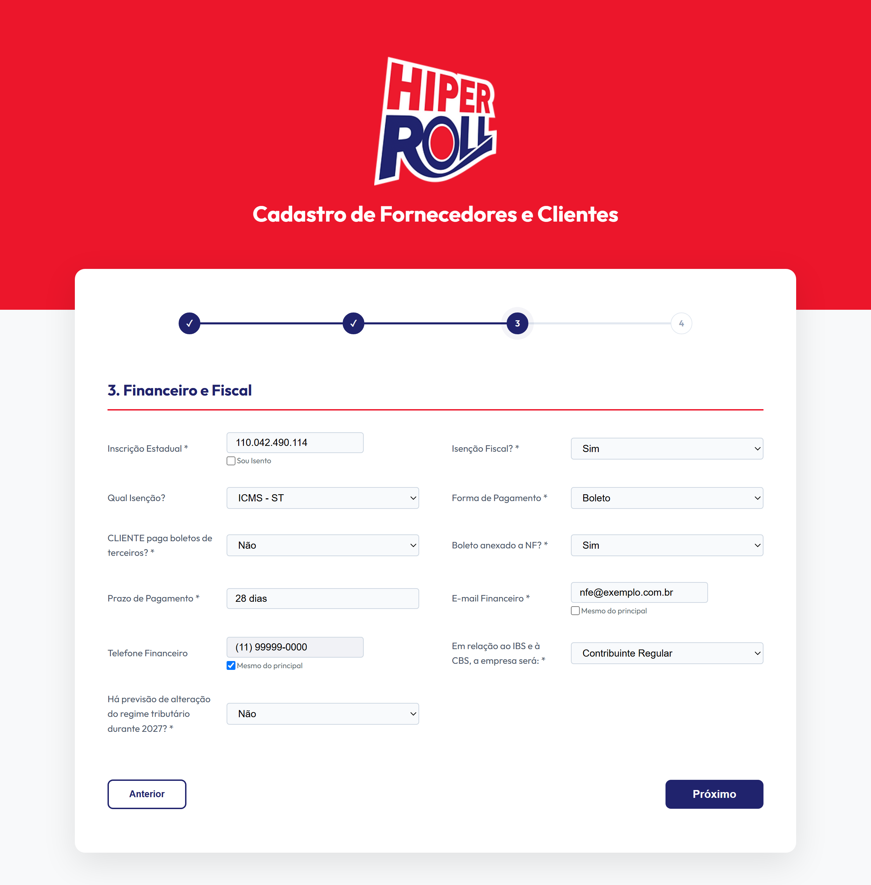</td>
    <td>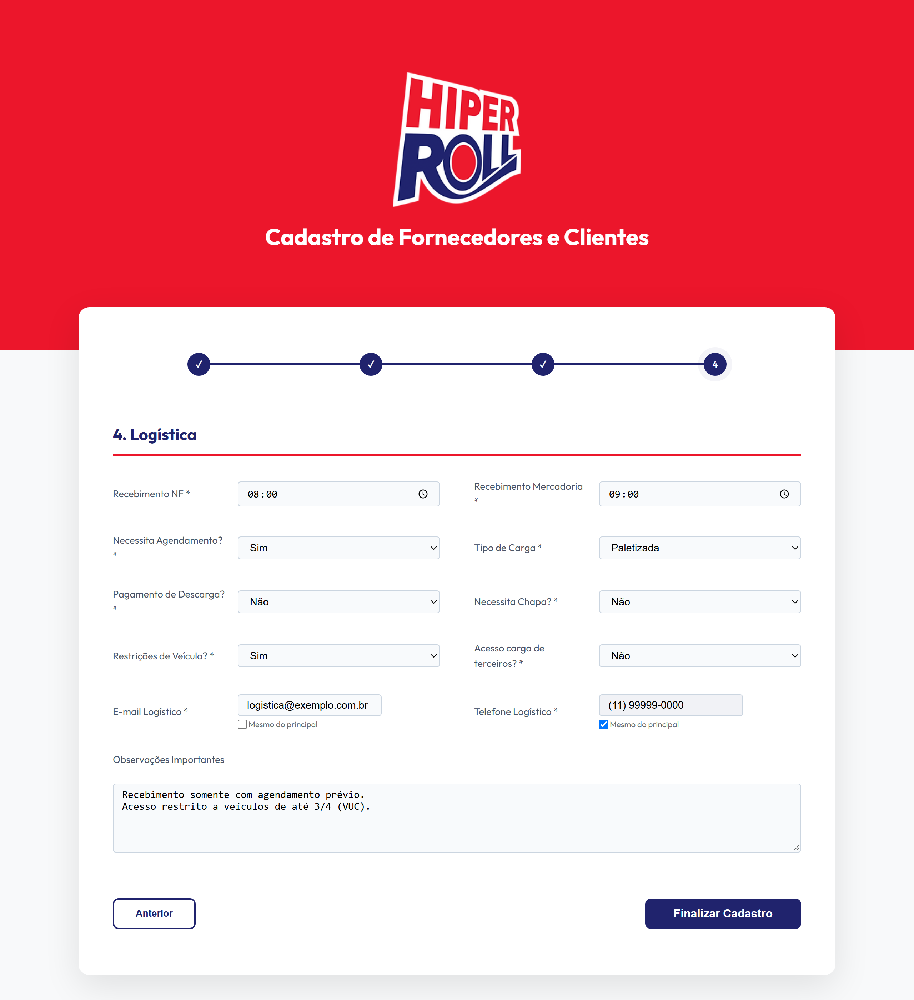</td>
  </tr>
  <tr>
    <td align="center"><b>3. Financeiro e fiscal</b><br>Campo de isenção condicional e atalho "Mesmo do principal"</td>
    <td align="center"><b>4. Logística</b><br>Condições de recebimento e observações</td>
  </tr>
</table>

### Validação e CNPJ não encontrado

<table>
  <tr>
    <td width="50%">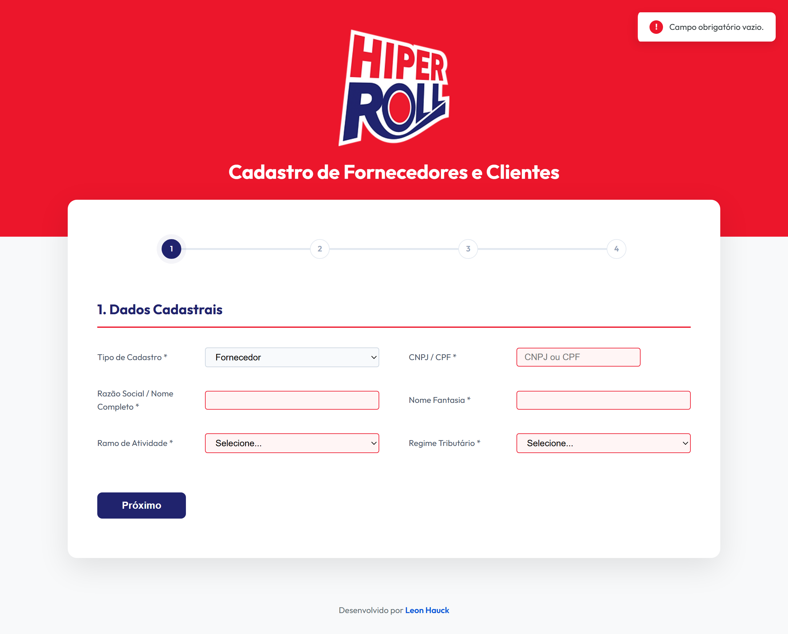</td>
    <td width="50%">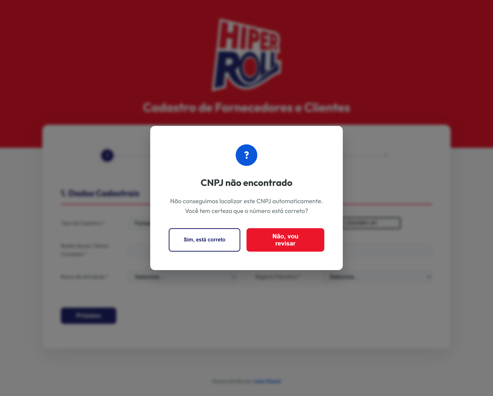</td>
  </tr>
  <tr>
    <td align="center"><b>Validação por etapa</b><br>Campos pendentes em destaque e aviso no canto da tela</td>
    <td align="center"><b>CNPJ não encontrado</b><br>Confirmação que libera o preenchimento manual</td>
  </tr>
</table>

### Confirmação do envio

<div align="center">
  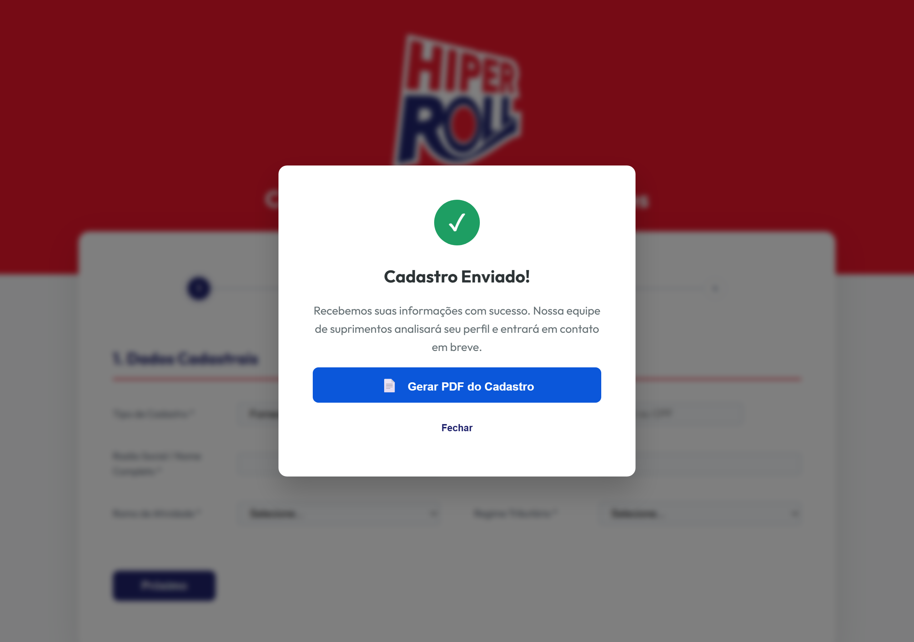
</div>

### Ficha em PDF e e-mail para a equipe

<table>
  <tr>
    <td width="50%" valign="top">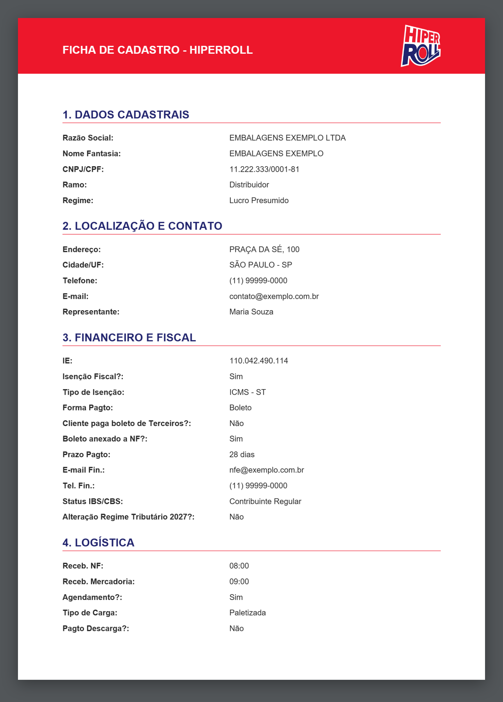</td>
    <td width="50%" valign="top">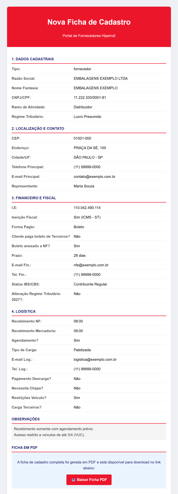</td>
  </tr>
  <tr>
    <td align="center"><b>Ficha de cadastro</b><br>Primeira página do PDF gerado no navegador</td>
    <td align="center"><b>E-mail de notificação</b><br>Dados completos e link para baixar a ficha</td>
  </tr>
</table>

### Versão para celular

<div align="center">
  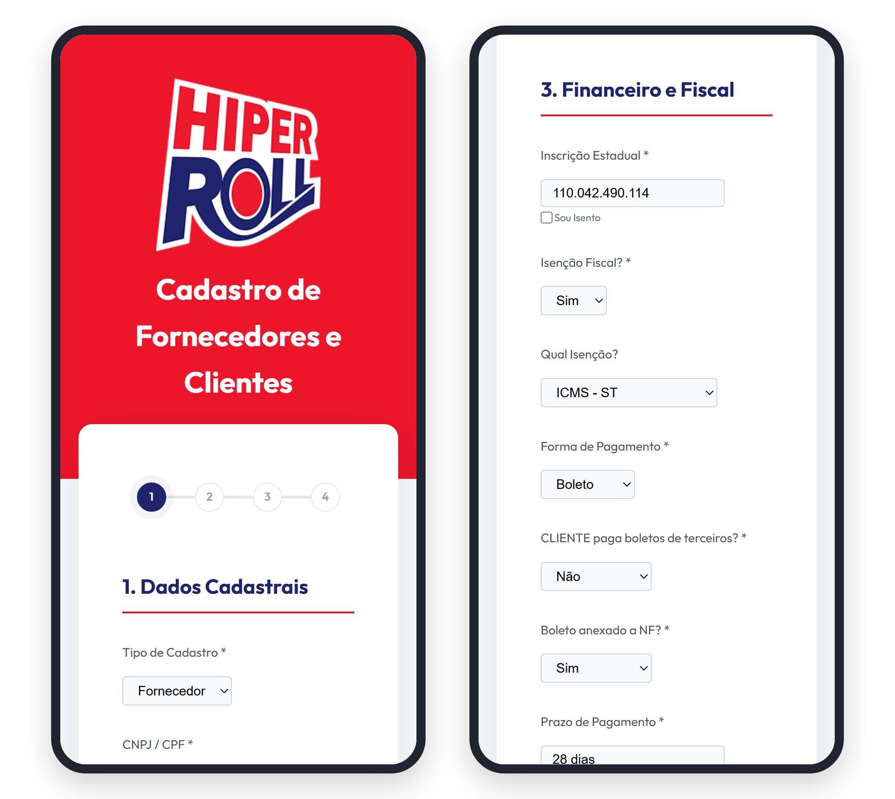
</div>

## Como funciona

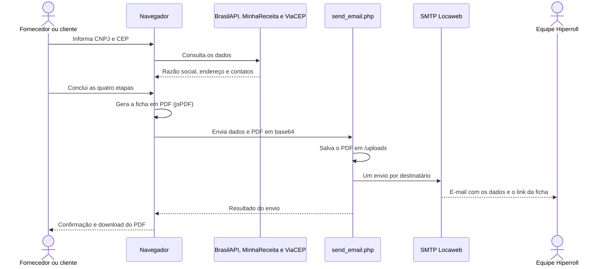

Duas decisões explicam o desenho:

- **PDF por link, não por anexo.** A API REST do SMTP Locaweb não aceita anexos no envio por JSON. Por isso o PHP grava o PDF na pasta `uploads/` e inclui no e-mail um botão que aponta para o arquivo.
- **Envio de e-mail no servidor.** O token do serviço de e-mail fica no `.env`, lido apenas pelo PHP, e nunca chega ao navegador.

## Tecnologias

| Camada | Tecnologia |
| --- | --- |
| Interface | HTML5, CSS3 e JavaScript puro, sem framework e sem build |
| Geração de PDF | [jsPDF](https://github.com/parallax/jsPDF) 2.5.1, carregado por CDN |
| Servidor | PHP com cURL, em um único script |
| Dados de empresas | [BrasilAPI](https://brasilapi.com.br/) e [MinhaReceita](https://minhareceita.org/) |
| Endereços | [ViaCEP](https://viacep.com.br/) |
| E-mail | [SMTP Locaweb](https://www.locaweb.com.br/smtp-locaweb/), API REST |

## Estrutura do projeto

```
.
├── index.html                           # Formulário em quatro etapas e janelas de confirmação
├── style.css                            # Identidade visual e layout responsivo
├── script.js                            # Navegação, validação, consultas, máscaras e geração do PDF
├── send_email.php                       # Recebe o cadastro, salva o PDF e dispara os e-mails
├── .env.example                         # Modelo das variáveis de ambiente
├── .htaccess                            # Bloqueia o acesso ao .env e a listagem de diretórios
├── Novo-Logotipo-HiperRoll.png          # Logotipo usado na página e no cabeçalho do PDF
├── cartilha_cadastro_representantes.md  # Guia de preenchimento para representantes
└── docs/screenshots/                    # Imagens deste README
```

Em produção, o servidor cria ainda a pasta `uploads/` (fichas em PDF) e o arquivo `error_email.log`. Esses itens, o `.env` e os scripts de teste com credenciais ficam fora do Git, pelo `.gitignore`.

## Configuração

Copie o modelo e preencha os valores:

```bash
cp .env.example .env
```

| Variável | Obrigatória | Descrição |
| --- | --- | --- |
| `SMTP_TOKEN` | Sim | Token da API do SMTP Locaweb |
| `SMTP_REMETENTE` | Sim | E-mail remetente, autorizado na conta do SMTP Locaweb |
| `SMTP_DESTINATARIO` | Não | Quem recebe os cadastros. Aceita vários endereços separados por vírgula. Padrão: `grupocomercial@hiperroll.com.br` |
| `SMTP_ASSUNTO` | Não | Assunto do e-mail; a razão social é acrescentada ao final. Padrão: `Novo Cadastro - Portal Hiperroll` |

## Executando localmente

Requisitos: PHP 7.4 ou superior com a extensão cURL habilitada.

```bash
git clone https://github.com/LeonHauck/CadastroFornecedoresHiperRoll.git
cd CadastroFornecedoresHiperRoll
cp .env.example .env    # preencha o token e o remetente
php -S localhost:8000
```

Abra <http://localhost:8000> no navegador.

Para ver apenas a interface, basta abrir o `index.html` direto no navegador. As consultas de CNPJ e CEP e o PDF funcionam; o envio do e-mail não, porque depende do PHP.

## Publicação

1. Envie os arquivos para uma hospedagem com Apache e PHP (HostGator, Locaweb ou similar).
2. Envie também o `.env` preenchido. Arquivos iniciados por ponto costumam ficar ocultos no gerenciador de arquivos da hospedagem, então confira se ele chegou ao servidor.
3. Garanta permissão de escrita na pasta do projeto, para que o PHP crie `uploads/` e `error_email.log`.
4. Faça um cadastro de teste e confira o recebimento do e-mail. Se não chegar, o motivo estará em `error_email.log`.

A pasta `docs/` não precisa ir para o servidor, e scripts de teste com credenciais não devem ser enviados.

## Segurança

- O `.htaccess` bloqueia o acesso direto ao `.env` e ao `.env.example` e desativa a listagem de diretórios. Essa proteção vale para Apache; em outro servidor, configure o bloqueio equivalente.
- O token do serviço de e-mail é lido apenas pelo PHP e não aparece no código enviado ao navegador.
- Credenciais não são versionadas: o `.env` e os scripts de teste que contêm token estão no `.gitignore`.
- As fichas em `uploads/` ficam acessíveis a quem tiver o link, e os links não expiram. A pasta não é listável, mas vale apagar os arquivos antigos periodicamente.

## Documentação de apoio

A [cartilha de cadastro](cartilha_cadastro_representantes.md) explica o preenchimento campo a campo e pode ser repassada a representantes e novos usuários do portal.

## Autor

Desenvolvido por [Leon Hauck](https://www.linkedin.com/in/leon-hauck/).
